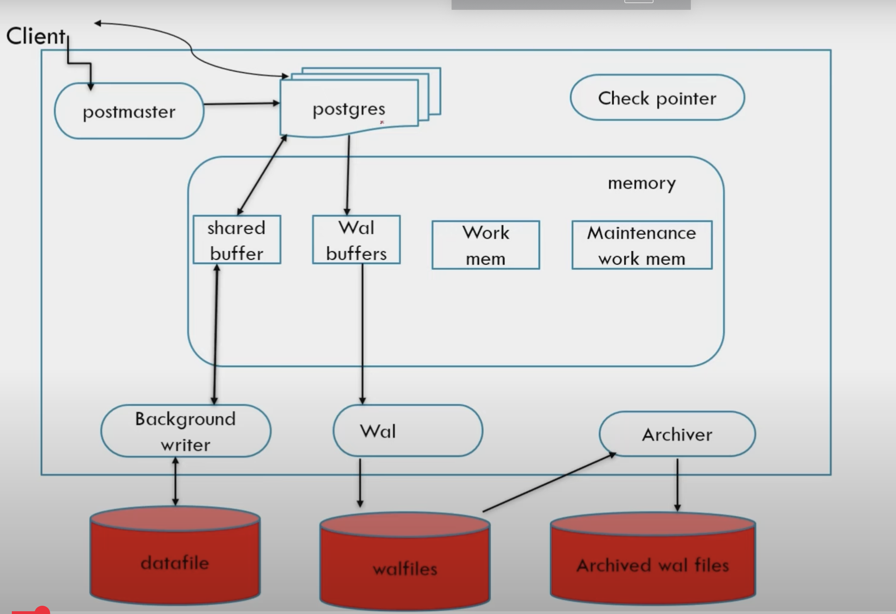

### PostgresQL Architecture components to keep in mind
There are several such components which must be considered for performane, security and scalability. Below are few such components

The **PostgreSQL architecture** here shows the key components involved in handling queries, managing memory, and writing data via WAL (Write-Ahead Logging). In **AWS RDS for PostgreSQL** and **Amazon Aurora PostgreSQL**, many of these components are **configurable**, but some are **managed automatically**.

---

## **1️⃣ What is Configurable in AWS RDS & Aurora?**

| **Component**               | **AWS RDS** (Configurable?) | **Aurora PostgreSQL** (Configurable?)    | **Configuration Parameter**                        |
| --------------------------- | --------------------------- | ---------------------------------------- | -------------------------------------------------- |
| **Shared Buffers**          | ✅ Yes                       | ❌ No (Managed by Aurora)                 | `shared_buffers`                                   |
| **WAL Buffers**             | ✅ Yes                       | ❌ No                                     | `wal_buffers`                                      |
| **Work Memory**             | ✅ Yes                       | ✅ Yes                                    | `work_mem`                                         |
| **Maintenance Work Memory** | ✅ Yes                       | ✅ Yes                                    | `maintenance_work_mem`                             |
| **Checkpointer**            | ❌ No (Managed by AWS)       | ❌ No (Instant Recovery)                  | -                                                  |
| **Background Writer**       | ✅ Yes                       | ❌ No                                     | `bgwriter_lru_maxpages`, `bgwriter_lru_multiplier` |
| **WAL Archiving**           | ✅ Yes (Custom Archiving)    | ❌ No (Aurora does not use WAL archiving) | `archive_mode`, `archive_command`                  |
| **WAL Retention**           | ✅ Yes (Managed)             | ✅ Yes (Aurora Continuous WAL)            | `wal_keep_size`, `max_wal_size`                    |
| **Replication Slots**       | ✅ Yes                       | ✅ Yes                                    | `max_replication_slots`                            |
| **Autovacuum Settings**     | ✅ Yes                       | ✅ Yes                                    | `autovacuum`, `autovacuum_vacuum_cost_limit`       |
| **Storage Configuration**   | ❌ No (AWS Managed)          | ❌ No (Aurora Auto-scales)                | -                                                  |

### **Key Differences:**

1. **RDS PostgreSQL** allows most **standard PostgreSQL settings** but **manages storage and checkpointer processes**.
2. **Aurora PostgreSQL** **automatically manages WAL and storage**, removing the need for many configurations.

---

## **2️⃣ Topics for System Design with PostgreSQL in AWS**

To design a **scalable, high-performance, and fault-tolerant system using PostgreSQL on AWS**, we should focus on the following:

### **🛠️ Performance Optimization**

- **Connection Pooling**: Use **PgBouncer** or **RDS Proxy** for managing connections efficiently.
- **Indexing Strategies**: Understand **B-Tree, Hash, GIN, and BRIN indexes**.
- **Partitioning & Sharding**: Use **PostgreSQL native partitioning** or **Citus (for distributed Postgres)**.
- **Query Optimization**: Learn how to use **EXPLAIN ANALYZE** and **pg_stat_statements**.

### **🔹 Reliability & High Availability**

- **Replication Strategies**:
	- **Streaming Replication** for read replicas.
	- **Logical Replication** for cross-region replication.
- **Failover & Disaster Recovery**:
	- **Automated Multi-AZ failover in RDS**.
	- **Aurora automatic failover across AZs**.
- **Backup & PITR (Point-in-Time Recovery)**:
	- **RDS: WAL archiving & snapshots**.
	- **Aurora: Continuous WAL storage with backtrack**.

### **🔹 Security & Compliance**

- **Authentication**:
	- IAM-based authentication in AWS RDS.
	- Role-based access control (`pg_hba.conf` equivalent in AWS).
- **Encryption**:
	- **At Rest**: AWS KMS-backed encryption.
	- **In Transit**: SSL/TLS enforcement.
- **Network Security**:
	- Use **VPC Security Groups** to restrict access.
	- PrivateLink or VPN for secure connections.

### **🔹 Scalability**

- **Vertical Scaling**:
	- Increase **RDS instance types** (e.g., `db.m6g.large` → `db.m6g.2xlarge`).
- **Horizontal Scaling**:
	- Read Replicas for read-heavy workloads.
	- Aurora **Auto-Scaling Readers**.
- **Load Balancing**:
	- Use **Route 53 weighted routing** or an application-layer load balancer.

### **🔹 Observability & Monitoring**

- **AWS CloudWatch** for tracking:
	- **CPU, Memory, Disk IO, Queries per second**.
- **Performance Insights** to analyze:
	- **Slow queries, Lock Contention, Query Execution Plans**.
- **Prometheus + Grafana** for advanced observability.

### **🔹 Multi-Tenant PostgreSQL Design**

- **Schema-Based Multi-Tenancy** (one schema per tenant).
- **Database-Level Multi-Tenancy** (separate DB per tenant).
- **Row-Level Security (RLS)** to enforce tenant isolation.

---

## **3️⃣ Learning Path for System Design**

If we're preparing for **system design interviews** or **architecting PostgreSQL-based solutions in AWS**, here’s a structured learning path:

### **Step 1: Master PostgreSQL Internals**

✅ Learn about **WAL, shared buffers, autovacuum, indexing**.

### **Step 2: Understand AWS Database Services**

✅ Compare **AWS RDS PostgreSQL vs. Aurora PostgreSQL**.

### **Step 3: High Availability & Scaling**

✅ Learn about **multi-AZ failover, read replicas, connection pooling**.

### **Step 4: Security & Compliance**

✅ Understand **IAM roles, VPC security, and encryption**.

### **Step 5: Observability & Performance Optimization**

✅ Use **CloudWatch, Prometheus, pgbadger, and EXPLAIN ANALYZE**.